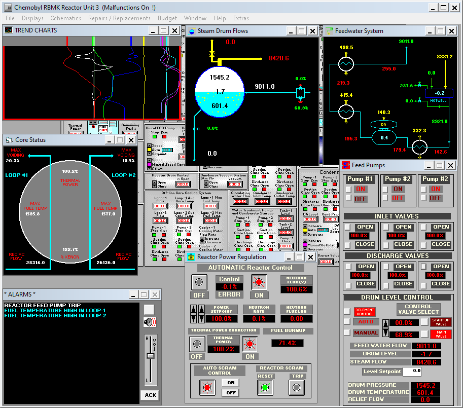
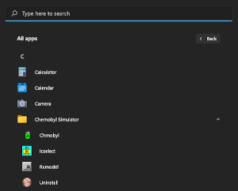

# Chernobyl Simulator

Chernobyl Simulator is a port of the simulation game [_Chernobyl: The Legacy
Continues_](https://web.archive.org/web/19990429163349/http://www.gatekeepsw.com:80/)
to modern 64-bit Windows. The original version was released by Gatekeeper
Technology Group in 1998 for Windows 3.1 and Windows 95.

Your goal is to safely operate the Chernobyl Nuclear Power Plant Unit 3, fixing
any malfunctions that arise, while keeping the whole operation on a tight
budget. You will learn about RBMK reactors and nuclear power plants in general.

The manual remains the primary resource to learn how to play, but you may want
to read ["Getting started with Chernobyl
Simulator"](https://dzx.fr/blog/getting-started-with-chernobyl-simulator/) for
an introduction to the game.

## Releases

| Type   | Version | Download                                |
| ------ | ------- | --------------------------------------- |
| Setup  | 0.2.0   | [`chernobyl-setup.exe`][setup]          |
| Manual | (scan)  | [`chernobyl-manual-scan.pdf`][man_scan] |
| Manual | (conv)  | [`chernobyl-manual-conv.pdf`][man_conv] |

[setup]: https://github.com/gdzx/chernobyl-simulator/releases/download/v0.2.0/chernobyl-setup.exe
[man_scan]: https://github.com/gdzx/chernobyl-simulator/releases/download/v0.1.0/chernobyl-manual-scan.pdf
[man_conv]: https://github.com/gdzx/chernobyl-simulator/releases/download/v0.1.0/chernobyl-manual-conv.pdf

To run the game, use the shortcuts added by the installer to the Windows Start
Menu:

There are 2 versions of the manual:

- Scan of the copy distributed with the original game.
- Conversion of an original WordPerfect draft to PDF.

The scan is monochrome with a lower text quality, but the converted draft
content may slightly differ from the final version.

## Extras

I had to make slight changes to the original game to make it work under
_otvdm_. For convenience, I also added the following features to the menu
_Extras_:

- _Pause_: pauses the simulation.
- _Malfunctions_: toggles malfunctions on/off.
- _Fuel_: freezes fuel burnup.
- _Videos_: blocks video popups.

## Acknowledgements

- [_otvdm_](https://github.com/otya128/winevdm): 16-bit Windows emulator based
  on [Wine](https://www.winehq.org).
- [NSIS](https://nsis.sourceforge.io/Main_Page): installation wizard.
- [SimGenics](https://simgenics.com): permission to distribute this modified
  version of their game.

## License

Unless otherwise noted, all rights go to the original authors (see
[LICENSE.rtf](LICENSE.rtf)).
